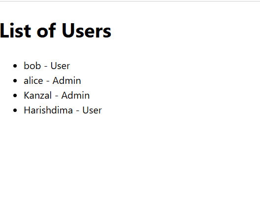

# 🛡️ IAM Dashboard – Identity & Access Management System

This is a Java Spring Boot-based IAM (Identity & Access Management) dashboard that demonstrates key features such as:

- ✅ User and Role Management
- ✅ Permissions assignment
- ✅ Audit Logging
- ✅ Thymeleaf-based frontend
- ✅ MVC Architecture using Spring Boot

---

## 🚀 Features

- List all users and their roles
- Add new users and assign roles
- View system-defined roles and their permissions
- Maintain audit logs with timestamped actions

---

## 🖥️ Tech Stack

- **Java**
- **Spring Boot**
- **Thymeleaf**
- **HTML / CSS**
- **Git & GitHub**
- **IntelliJ IDEA**

---

## 📸 Dashboard Preview

| Dashboard                                             | Users List                                    | Audit Logs                                        |
|-------------------------------------------------------|-----------------------------------------------|---------------------------------------------------|
|  |  |  |


---

## 🔧 How to Run the Project

1. Clone the repository:
   ```bash
   git clone https://github.com/DimaNaeem/iam-dashboard.git
   cd iam-dashboard
