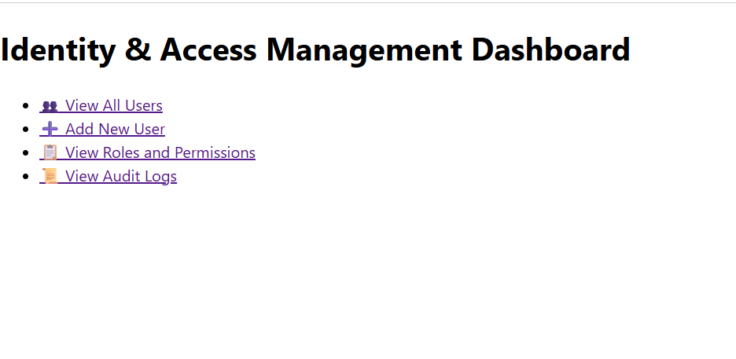
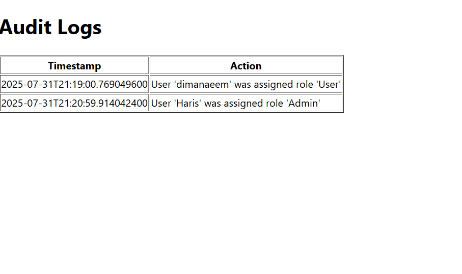

# 🛡️ IAM Dashboard – Identity & Access Management System

This is a Spring Boot-based Identity & Access Management Dashboard that enables secure role-based access control. It allows admins to manage users, assign roles and permissions, and view audit logs through a user-friendly interface built with Thymeleaf
- ✅ User and Role Management
- ✅ Permissions assignment
- ✅ Audit Logging
- ✅ Thymeleaf-based frontend
- ✅ MVC Architecture using Spring Boot

---

## 🚀 Features

- ✅ Role-Based Access Control (RBAC)
- ✅ Add/Edit/Delete Users
- ✅ Assign Roles & Permissions
- ✅ Audit Logging for User Actions
- ✅ Thymeleaf Frontend (HTML/CSS)
- ✅ Built using MVC with Spring Boot

---

## 🖥️ Tech Stack

- **Java**
- **Spring Boot**
- **Thymeleaf**
- **HTML / CSS**
- **Git & GitHub**
- **IntelliJ IDEA**

---

## 📸 Dashboard Preview

| Dashboard                                             | Users List                                    | Audit Logs                                        |
|-------------------------------------------------------|-----------------------------------------------|---------------------------------------------------|
|  |  |  |


---

## 🔧 How to Run the Project

1. Clone the repository:
   ```bash
   git clone https://github.com/DimaNaeem/iam-dashboard.git
   cd iam-dashboard
